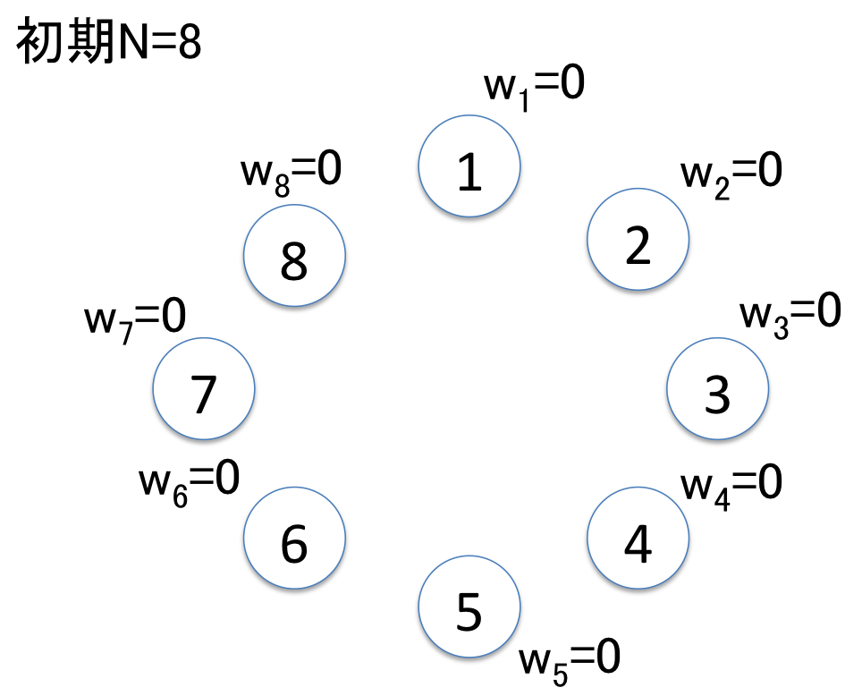
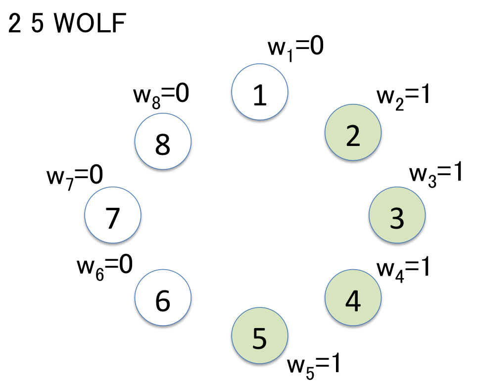
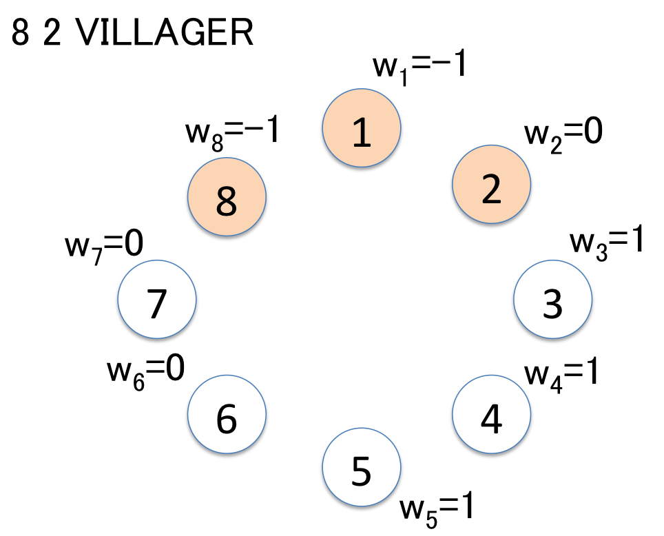

# インディアンワンナイト人狼オフ会
にゃまさんは人狼が大好きです。しかし人狼のルールは複雑で、事前知識なしで始めることが難しいゲームなため、新規参入者が増えません。
そこでにゃまさんは、インディアンワンナイト人狼のオフ会を主催し、新規参入者の獲得を目論みました。

## インディアンワンナイト人狼（この章は問題に関係ありません）
インディアンワンナイト人狼とは、自分の陣営はわからないけれども、他人の陣営はすべてわかる特殊な人狼です。
プレイヤーは、人狼陣営と村人陣営のどちらかの陣営に属しており、対抗する陣営のプレイヤーを処刑することが勝利条件になります。
ゲームのやり方は以下の通りです。

1. プレイヤーの数と同数の人狼カードと村人カードを用意し、よく混ぜ合わせてプレイヤーに配る
2. 自分で見ないように、かつ他のプレイヤーに見えるように額にカードを当てる
3. 他のプレイヤーの陣営を確認しつつ議論をして、誰に投票するかを決める
4. 1人1票ずつ持って他プレイヤーに投票をし、もっとも票を集めたプレイヤー全員を処刑する

このゲームのポイントは、まず議論を通じて自分の陣営を予測することです。
次に、味方になってくれそうなプレイヤーを誘導して、自分の予測した陣営と反対のプレイヤーを処刑することにあります。

[参考URL](http://jinrowhite.blogspot.jp/2013/10/blog-post_7758.html)

## 問題
この人狼オフ会では、N人の参加者が下図のように輪になって並び、インディアンワンナイト人狼をします。



人狼において、プレイヤーが人狼と村人のどちらの陣営に見えるかはとても大事です。

そこでこのオフ会では特別に、各プレイヤーがどちらの陣営に見えるかを可視化する、人狼度wと呼ばれる基準を設けます。人狼度wは以下のように定義します。
```
人狼度w = 人狼(WOLF)と疑われた回数 - 村人(VILLAGER)と信じられた回数
```
人狼と疑われた回数や村人と信じられた回数は、議論を通じて変化します。
最終的に、人狼度が最大のプレイヤーが処刑され、ゲームが終了します。

にゃまさんはより円滑にゲームを行うため、プレイヤーの発言から各プレイヤーの人狼度の集計を行うプログラムを作ろうと考えました。このプログラムには、以下のような発言が複数入力されます。

`l r X` : 参加者lから時計回りに参加者rまでを陣営X(={WOLF | VILLAGER})と疑う/信じる

例えば8人プレイヤーがいたとき、
```
2 5 WOLF
8 2 VILLAGER
```
という入力があると、各プレイヤーの人狼度は下図のように変化します。
集計の結果、人狼度が最大のプレイヤーは3, 4, 5の3人になります。





集計プログラムを書こうとしたにゃまさんは、残念なことにプログラミングのスキルが高くありませんでした。
そこでエンジニアであるあなたは、にゃまさんに代わって発言を集計し、人狼度が最大のプレイヤーを出力するプログラムを作成する仕事を任されました！

## 入力
入力は標準入力を用いて行われます。

1行目に参加者人数Nと入力の数Mが与えられます。
続くM行にわたって、発言の内容が記述されます。

```
N M
l1 r1 X1
l2 r2 X2
...
lM rM XM
```

## 出力
入力を受け切った後に、人狼度の最も高いプレイヤー全員の番号を改行区切りで出力してください。

### 入力サンプル1
```
8 2
2 5 WOLF
8 2 VILLAGER
```
### 出力サンプル1
```
3
4
5
```
問題文のサンプルです。

### 入力サンプル2
```
5 5
1 2 WOLF
4 4 WOLF
5 1 VILLAGER
1 5 VILLAGER
2 2 WOLF
```

### 出力サンプル2
```
2
```

## 制約条件
出力まで2s

### 簡単
* 1 <= N, M <= 100
* ヒント : 愚直に書いてもOK

### 難しい
* 1 <= N, M <= 2000
* ヒント : 最大ケースでは2s以内に集計するのが厳しいので工夫する

### 知らないとつらい
* 1 <= N = M <= 2000
* i行目に、その時点での参加者iの人狼度を出力し、その後に人狼度が最大のプレイヤーを全員出力する

* ヒント : 特殊なデータ構造を使う
